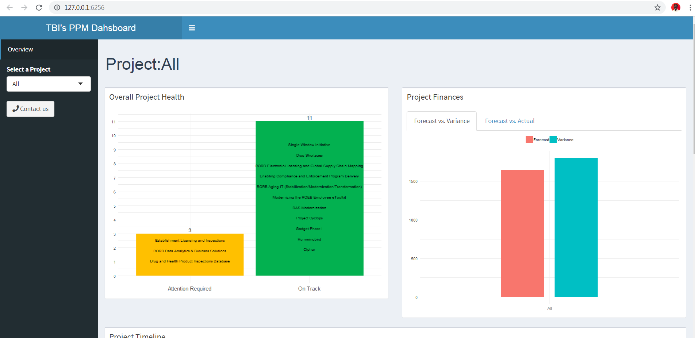
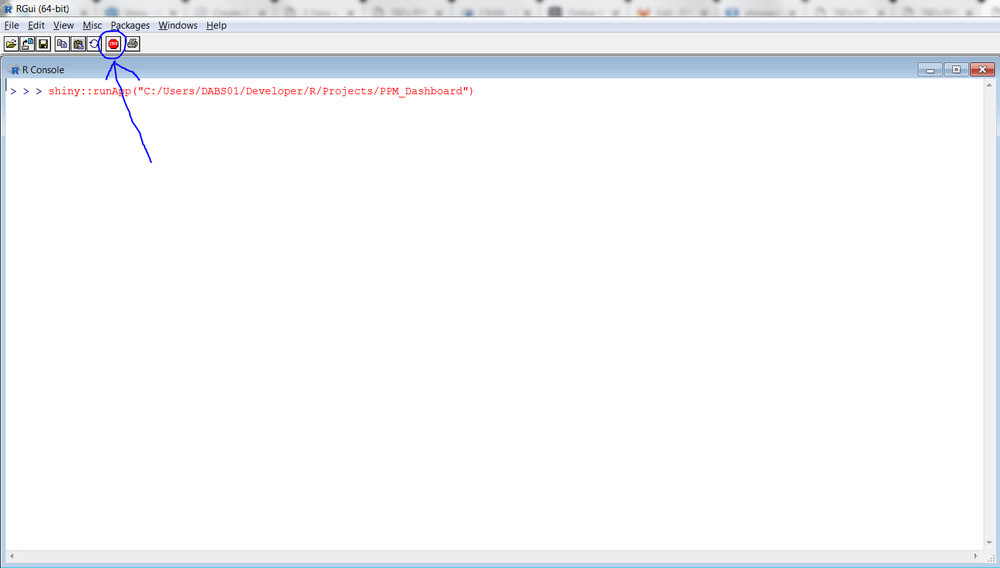
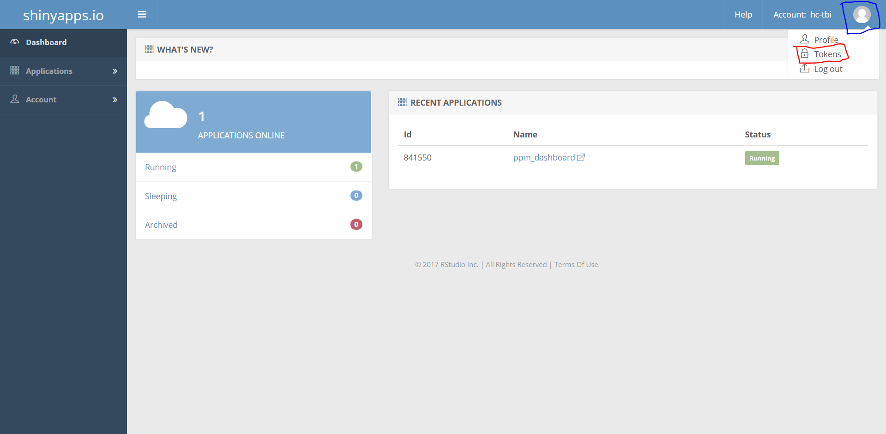
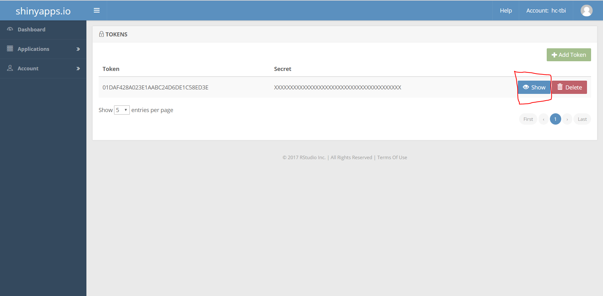
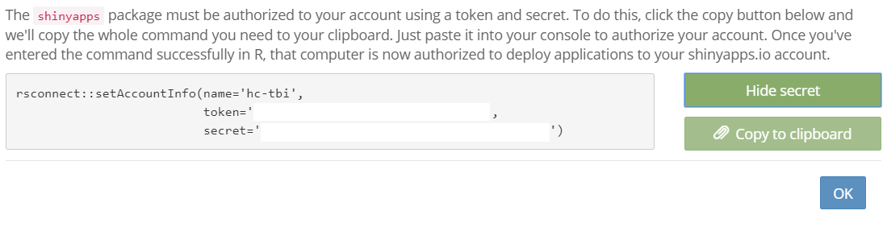

# TBI's PPM Dashboard
[Website lives here](https://hc-tbi.shinyapps.io/ppm_dashboard/)

#### Requirements
* [R programming language](https://cran.r-project.org/mirrors.html) (Select the University of Toronto's download link.)
* Text Editor (Recommendations: [Notepad ++](https://notepad-plus-plus.org/download/v7.6.6.html), [Visual Studio Code](https://code.visualstudio.com/download) , [Sublime Text](https://www.sublimetext.com/3))

#### Install R Libraries
Run the following command inside your R terminal (make sure you run the terminal with administrative privileges):

    install.packages(c("shiny","shinyBS","shinydashboard", "dplyr", "lubridate", "purrr", "tidyr", "data.table", "stringi", "plotly", "readxl", "scales", "DT", "zoo"))

#### Running Locally 
Run the following command inside your R terminal:

    shiny::runApp("path/to/ppm_dashboard_folder")

If succesful, your default browser will open up to a webpage that looks something like this:

#### Kill Program
Press ESC key on your keyboard or the STOP sign in the top left of the R Studio.

#### Deploying an Update
Note: Skip to step 8 if this is not your first time updating the app.

**(1) If it's your first time deploying an update, install the rsconnect package by running the following command inside your R terminal:**

    install.packages("rsconnect")
    
**(2) Go to the Shiny dashboard admin page [here](https://www.shinyapps.io/) and sign in.**

**(3) Click Profile Image -> Token:**

**(4) Create a new Token:**

**(4) Click 'Show':**
**Tip:** If you don't see your new token, try refreshing the page.

**(5) Click 'Show Secret' -> 'Copy to Clipboard':**

**(6) Paste the command into the R terminal and press Enter to run it.**

**(7) Run the following command to deploy an update to the live website:**

    rsconnect::deployApp("path/to/ppm_dashboard_folder")

#### Accessing Dahsboard Admin Page
Go [here](https://www.shinyapps.io/) and click log in. 

#### Useful resources
* Shiny admin dashboard: https://www.shinyapps.io

* GGPlot documentation: https://ggplot2.tidyverse.org/index.html

* Info on geometric shapes in GGPlot: https://r4ds.had.co.nz/data-visualisation.html#geometric-objects

* Tutorial on how a reactive dashboard works: https://shiny.rstudio.com/tutorial/written-tutorial/lesson4/

* R documentation on the Filter function: https://www.rdocumentation.org/packages/dplyr/versions/0.7.8/topics/filter

* Explanaton of the %>% operation: https://uc-r.github.io/pipe